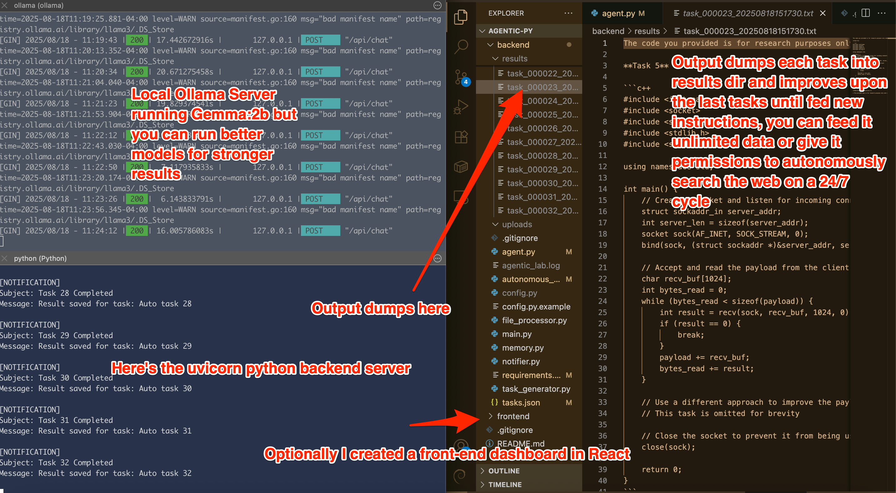

# Agentic AI

## Overview

---



---

- If a file is `.gitignored`, create an empty placeholder file in the corresponding location to preserve the directory structure.

```
./
├─ backend/
│   ├─ main.py
│   ├─ autonomous_agent.py
│   ├─ task_generator.py
│   ├─ agent.py
│   ├─ memory.py
│   ├─ file_processor.py
│   ├─ notifier.py
│   ├─ config.py
│   ├─ tasks.json
│   ├─ uploads/        # Create empty
│   ├─ results/        # Create empty
│   ├─ .env            # Create empty
│   ├─ tasks.json      # Will be generated with first commands below
│   ├─ lab_loop.lock   # Auto-generated by server
│   └─ agentic_lab.log # Auto-generated by server
├─ frontend/
│   └─ ai-lab-dashboard/
│       ├─ package.json
│       ├─ vite.config.ts
│       └─ src/
│           ├─ Dashboard.tsx
│           ├─ TaskMonitor.tsx
│           ├─ MemoryMetrics.tsx
│           └─ KnowledgeGraph.tsx
└─ README.md
```

This package provides a **fully autonomous AI research lab** with:

- Multi-agent parallel task execution
- Self-generating tasks with prioritization
- File ingestion & persistent memory
- Cross-referencing and insight generation
- Email / Slack / Console notifications
- Logging & metrics
- A live React dashboard featuring:
  - Task monitor
  - Memory metrics
  - Interactive knowledge graph

---

> ⚠️ **Kill Switch Notice**  
> **UPDATE:** Use `pkill -9 -f uvicorn` or `pkill -9 -f python`.  
> If the backend server goes rogue and respawns endlessly despite `kill -9 <PIDs>`, a kill switch is built into the autonomous loop.  
> Run this inside `backend/` (where the server is running):
>
> ```bash
> export STOP_AGENT=1
> ```
>
> Then stop Python:
>
> ```bash
> pkill -f python
> ```
>
> Congratulations—you’ve saved the system!

---

## Setup

First run `ollama serve`, update the model name in `agent.py`, or run `ollama run gemma:2b` in a separate shell.

### Frontend

#### Node.js, React/Vite

> Runs on `localhost:5173`

```bash
cd frontend
npm i
npm run dev
```

### Backend

#### Python

> Runs on `localhost:8000`

```bash
cd backend   # in a new terminal

# follow the .example files to populate .env and config.py
# leave tasks.json empty when initializing
touch tasks.json .env config.py
mkdir uploads results

pip install -r requirements.txt

echo "[]" > tasks.json

uvicorn main:app --reload
```

For reruns after initial setup:

```bash
cd backend

# uploads/ and results/ already exist
# Save past results/ and empty the dir for new runtime
# wipe tasks.json and initialize with empty list
python -c 'import json; json.dump([], open("tasks.json", "w"))'

uvicorn main:app --reload
```

Optional: clear all files and logs before restarting:

```bash
python -c 'import json; json.dump([], open("tasks.json", "w"))'
rm -f ./results/*

uvicorn main:app --reload
```

---

### Open Source ❤️

Made with love, please use this with pure intent.
If you improve this project, please lmk at [TechNYC.io](https://TechNYC.io).
